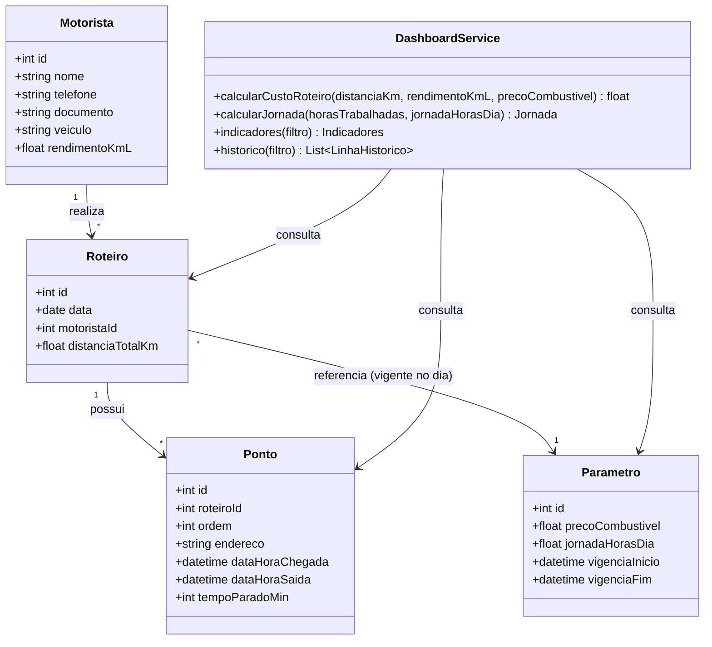

# Diagrama de Classes — Camada Gestora (Paulo)

Integra as entidades já modeladas por Marco (`Motorista`, `Roteiro`, `Ponto`) com a entidade
`Parametro`, introduzida pela camada gestora.

**Notas de modelagem:**

- `DashboardService` não é uma entidade persistida — representa a camada de serviço
  (`dashboardModel.js`) que agrega dados das entidades já existentes.
- `Parametro` é versionado por vigência (`vigenciaInicio`/`vigenciaFim`) para que roteiros
  antigos continuem refletindo o custo/jornada vigentes na época em que foram executados.
- `Ponto.tempoParadoMin` e `Ponto.ordem` são calculados pela camada operacional (RN01/RN02/RN03/RN06)
  e apenas consumidos, somados e agregados pela camada gestora.
