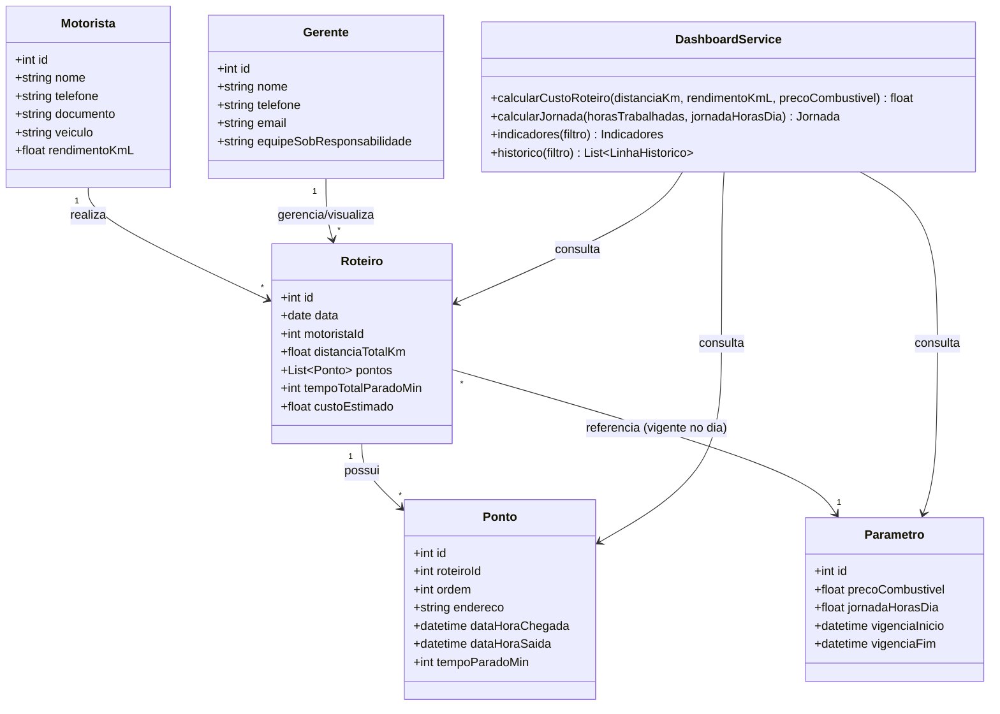

# Diagrama de Classes — Camada Gestora (v2)

Atualização em relação a `diagrama-classes-gestao.md`:
- Adicionada a classe `Gerente`, responsável por administrar/visualizar os roteiros (RF02).
- A classe `Roteiro` recebeu os atributos que faltavam para suportar o dashboard e o
  histórico: `pontos` (lista dos pontos do roteiro), `tempoTotalParadoMin` (RN03) e
  `custoEstimado` (RN07).

**Notas de modelagem:**

- `DashboardService` não é uma entidade persistida — representa a camada de serviço
  (`dashboardModel.js`) que agrega dados das entidades já existentes.
- `Parametro` é versionado por vigência (`vigenciaInicio`/`vigenciaFim`) para que roteiros
  antigos continuem refletindo o custo/jornada vigentes na época em que foram executados.
- `Ponto.tempoParadoMin` e `Ponto.ordem` são calculados pela camada operacional (RN01/RN02/RN03/RN06)
  e apenas consumidos, somados e agregados pela camada gestora.
- `Roteiro.pontos` é a coleção de pontos vinculados (mapeada via `roteiroId` em `Ponto`);
  representada aqui como atributo derivado para deixar explícita a composição usada pelo
  `DashboardService` e pelo histórico (UC05/UC07).
- `Roteiro.tempoTotalParadoMin` e `Roteiro.custoEstimado` são campos agregados/calculados
  (RN03 e RN07, respectivamente) e podem ser persistidos como cache ou calculados sob
  demanda pelo `DashboardService` — a decisão de persistência fica a critério da
  implementação, desde que o valor exibido seja sempre o recalculado mais recente.
- `Gerente` não referencia diretamente `Motorista`; a relação com `Roteiro` representa o
  escopo de gestão/visualização (ex.: dashboard e histórico filtrados pela equipe sob
  responsabilidade do gerente), sem impor exclusividade de acesso no MVP.
