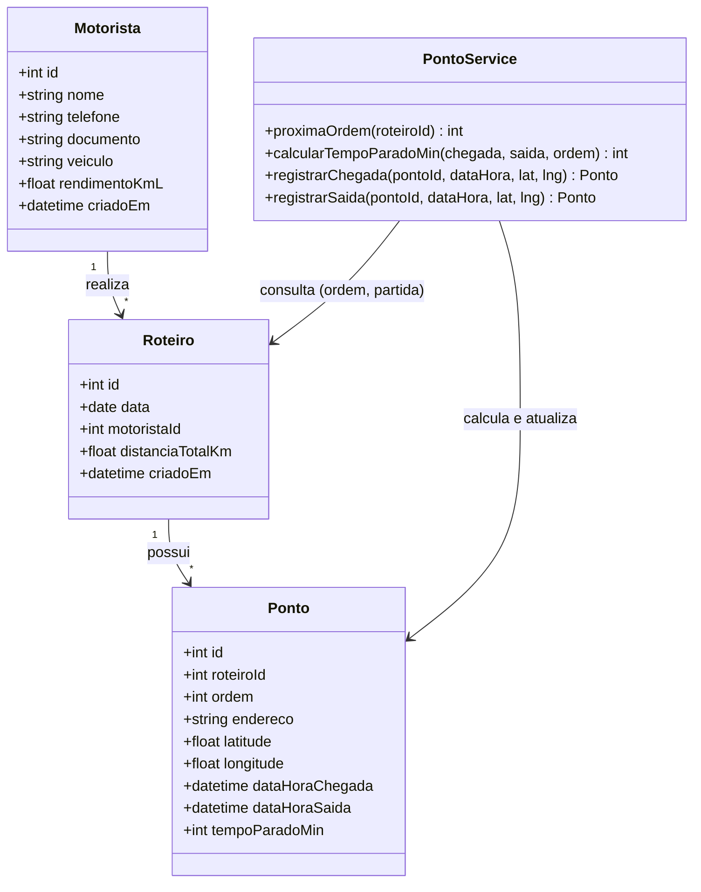

# Diagrama de Classes — Camada Operacional (Marco)

Modelagem conceitual das entidades de cadastro e operação de campo: `Motorista`, `Roteiro`
e `Ponto`. O serviço `PontoService` concentra as regras de negócio de tempo parado e
ordenação (RN01, RN02, RN03, RN06), que a camada gestora (Paulo) apenas consulta e agrega.

**Notas de modelagem:**

- `PontoService` não é uma entidade persistida — representa a camada de serviço
  (`pontoModel.js`) responsável por aplicar as regras de negócio antes de gravar no banco.
- **RN06**: `proximaOrdem` garante que cada novo ponto de um roteiro receba `ordem = último + 1`.
- **RN01**: quando `ordem = 1` (ponto de partida), `tempoParadoMin` é sempre `0`, mesmo que
  chegada e saída estejam preenchidas.
- **RN02**: para os demais pontos, `tempoParadoMin = dataHoraSaida − dataHoraChegada`, em minutos.
- **RN03** (consumida pela camada gestora): a soma de `tempoParadoMin` de todos os pontos com
  `ordem > 1` de um roteiro compõe o `tempo_total_parado_min` exibido em `Roteiro.buscarPorId`.
- `Motorista.rendimentoKmL` é o dado operacional que a camada gestora usa, junto ao parâmetro
  de combustível, para calcular o custo do trajeto (RN07).
