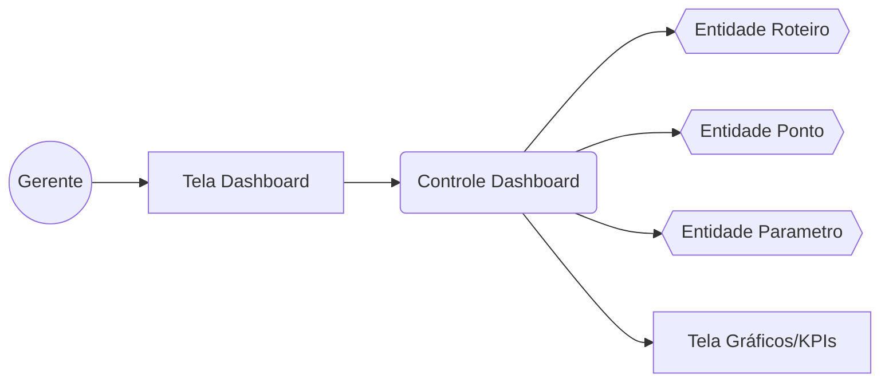
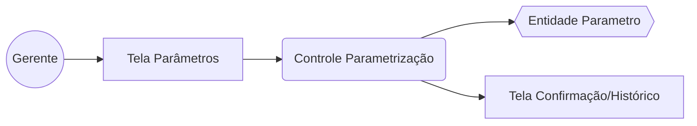
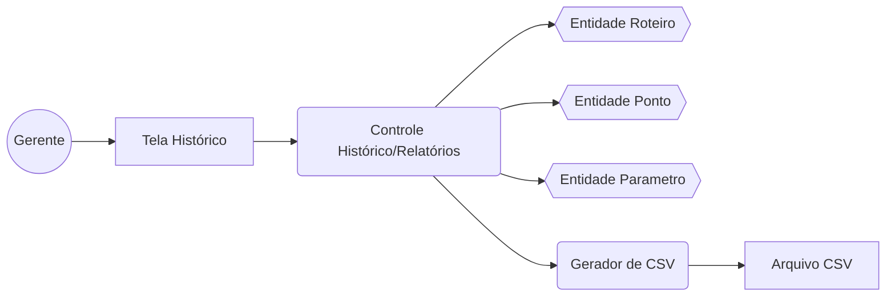

# Diagramas de Robustez — Camada Gestora (Paulo)

## UC05 — Consultar Dashboard

```mermaid
graph LR
    A((Gerente)) --> B[Tela Dashboard]
    B --> C(Controle Dashboard)
    C --> D{{Entidade Roteiro}}
    C --> E{{Entidade Ponto}}
    C --> F{{Entidade Parametro}}
    C --> G[Tela Gráficos/KPIs]
```

## UC06 — Parametrizar Custos/Jornada

```mermaid
graph LR
    A((Gerente)) --> B[Tela Parâmetros]
    B --> C(Controle Parametrização)
    C --> D{{Entidade Parametro}}
    C --> E[Tela Confirmação/Histórico]
```

## UC07 — Gerar Histórico/Relatórios

```mermaid
graph LR
    A((Gerente)) --> B[Tela Histórico]
    B --> C(Controle Histórico/Relatórios)
    C --> D{{Entidade Roteiro}}
    C --> E{{Entidade Ponto}}
    C --> F{{Entidade Parametro}}
    C --> G(Gerador de CSV)
    G --> H[Arquivo CSV]
```
