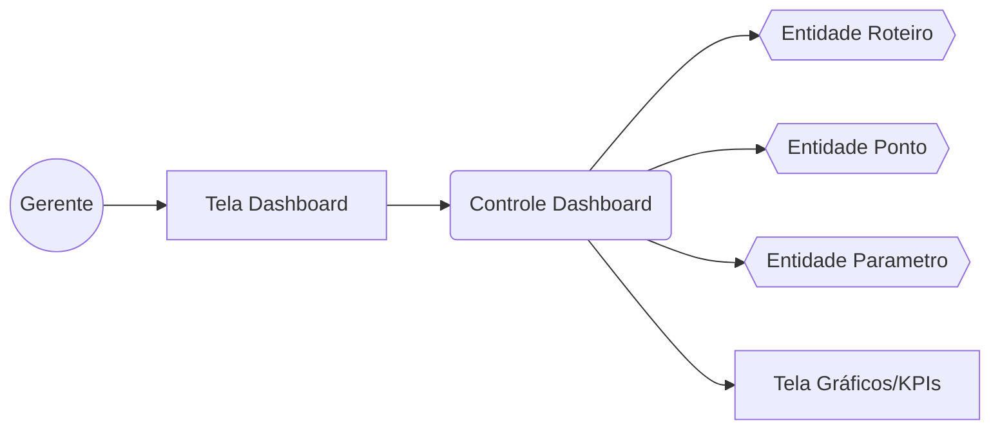
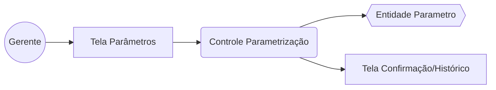
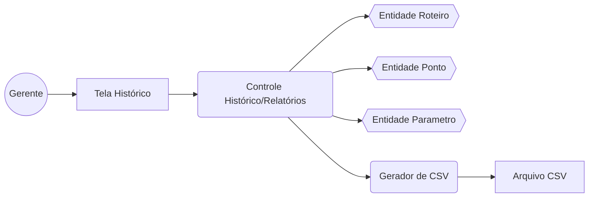
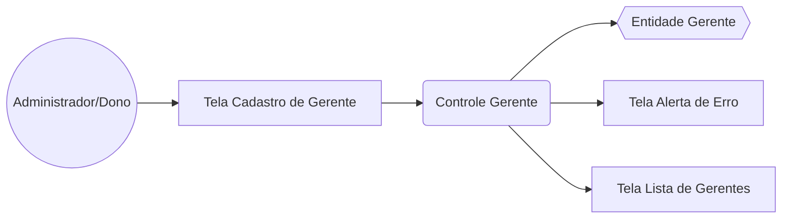

# Diagramas de Robustez — Camada Gestora (v2)

Atualização em relação a `diagramas-robustez-gestor.md`: adicionado o diagrama de robustez
do UC08 — Cadastrar Gerente.

## UC05 — Consultar Dashboard

## UC06 — Parametrizar Custos/Jornada

## UC07 — Gerar Histórico/Relatórios

## UC08 — Cadastrar Gerente

- `C → D`: valida campos obrigatórios (nome, e-mail) e grava; a **RN de e-mail único** é
  verificada pelo banco (constraint `UNIQUE`) e traduzida pelo controle em mensagem amigável.
- `C → E`: acionado nos fluxos alternativos FA01 (campo obrigatório em branco), FA02
  (e-mail duplicado) e FA03 (e-mail em formato inválido).
- `C → F`: em caso de sucesso, recarrega a lista de gerentes exibida na tela.
