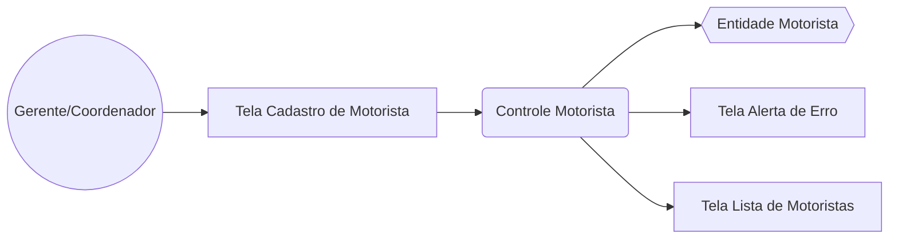
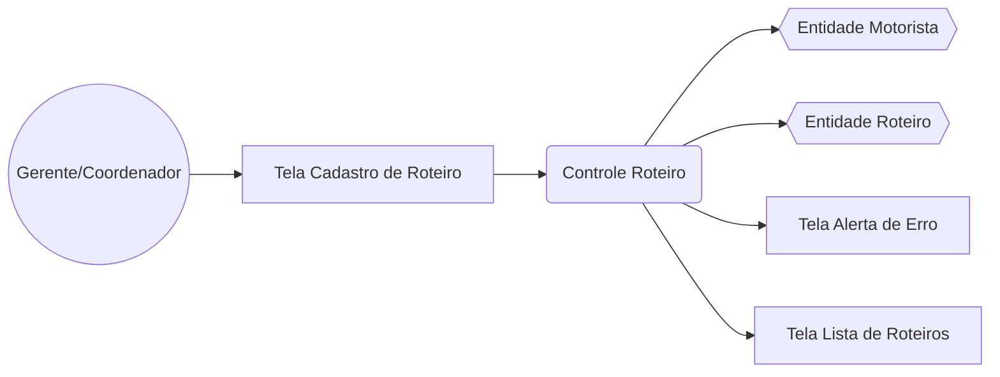
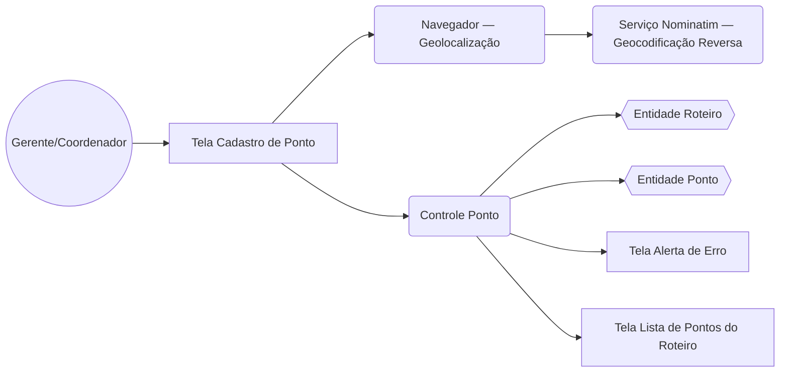
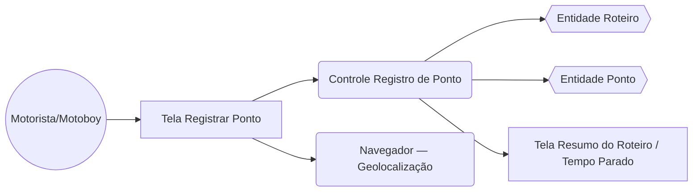

# Diagramas de Robustez — Camada Operacional (Marco)

Notação: `(( ))` ator, `[ ]` fronteira/tela, `( )` controle, `{{ }}` entidade.

## UC01 — Cadastrar Motorista / Motoboy

- `C → D`: valida campos obrigatórios e grava; a **RN de documento único** é verificada
  pelo próprio banco (constraint `UNIQUE`) e traduzida pelo controle em mensagem amigável.
- `C → E`: acionado nos fluxos alternativos FA01 (nome em branco) e FA02 (documento duplicado).
- `C → F`: em caso de sucesso, recarrega a lista exibida na tela.

## UC02 — Cadastrar Roteiro

- `C → D`: popula o dropdown de motoristas e valida se o `motoristaId` informado existe
  antes de criar o roteiro (chave estrangeira).
- `C → E`: aplica a **RN05** (um motorista + uma data por roteiro) ao gravar.
- `C → F`: acionado quando `data` ou `motoristaId` estão ausentes (FA01/FA02).

## UC03 — Cadastrar Ponto no Roteiro

- `B → H → I`: fluxo do botão "Usar minha localização" — captura coordenadas do dispositivo
  e resolve o endereço por geocodificação reversa (FA01/FA02 tratam recusa de permissão ou
  falha do serviço, mantendo o preenchimento manual).
- `C → E`: aplica a **RN06** (ordem sequencial automática = último + 1) antes de gravar.
- `C → D`: valida se o `roteiroId` selecionado existe (FE01).

## UC04 — Registrar Chegada/Saída em Ponto

- `B → F`: captura silenciosa da localização ao registrar chegada e saída (FA02 permite
  continuar sem coordenadas caso a permissão seja negada).
- `C → E`: grava `data_hora_chegada` / `data_hora_saida` e recalcula `tempoParadoMin`
  aplicando **RN01** (partida = 0 min) e **RN02** (saída − chegada).
- `C → D`: após cada saída registrada, recalcula o `tempo_total_parado_min` do roteiro (**RN03**)
  exibido na tela de resumo.
